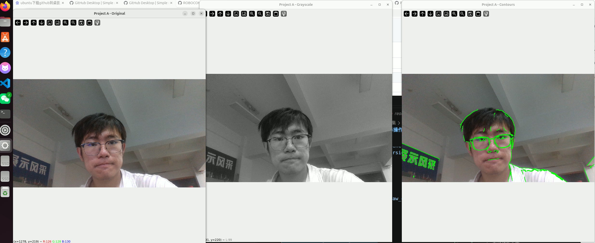
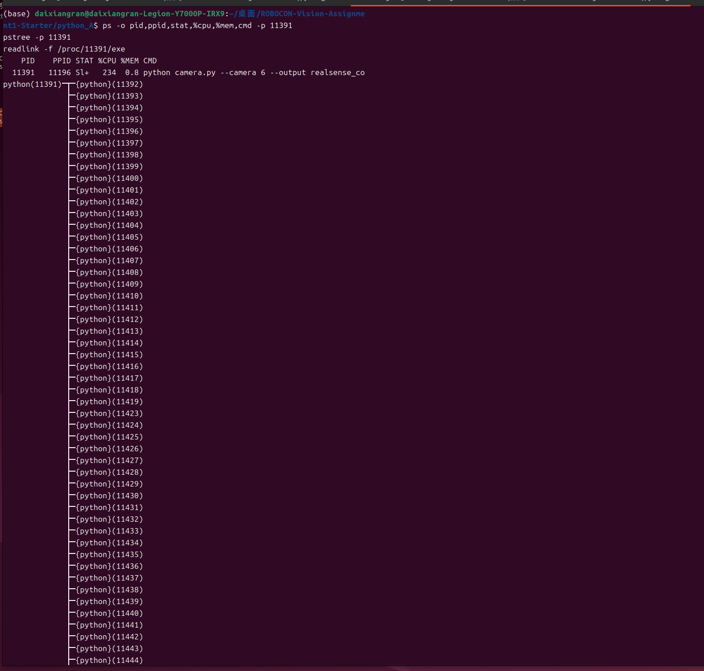
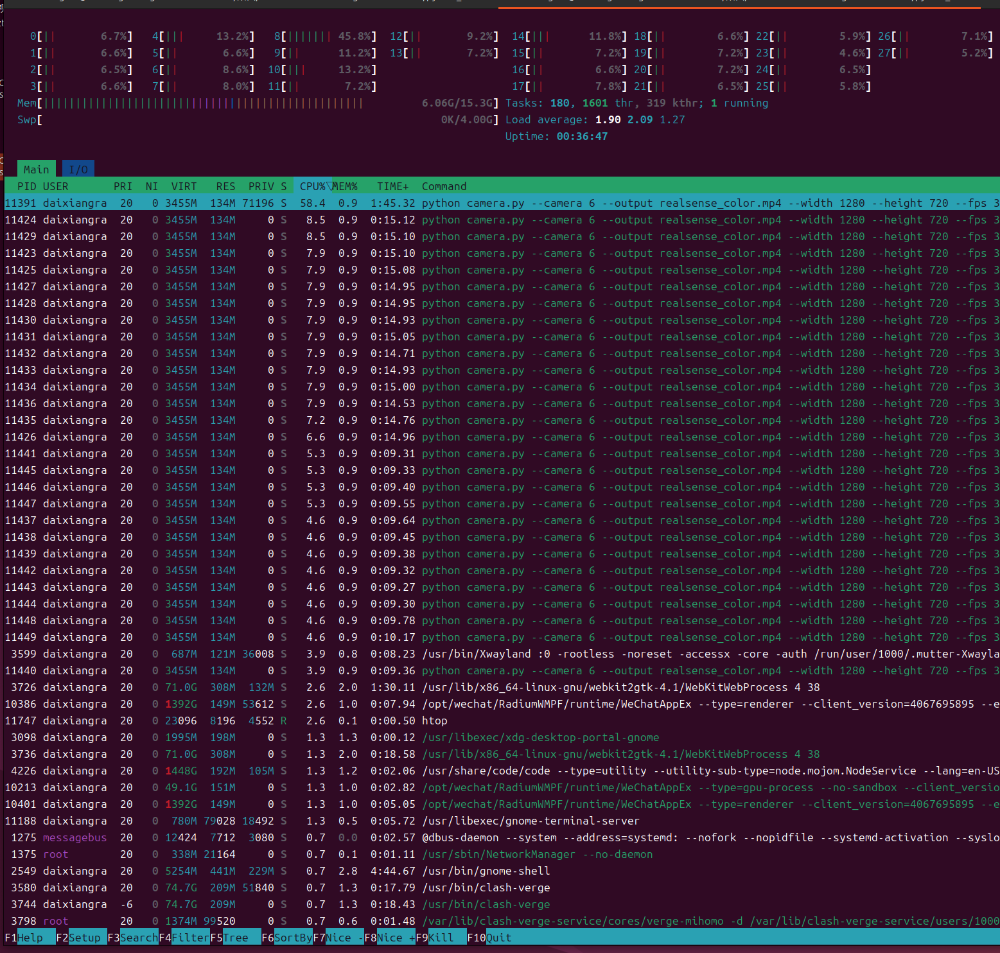
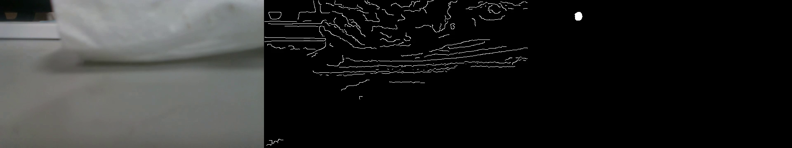

# Assignment 1

ROBOCON 视觉第一次作业。本仓库记录 Ubuntu 系统信息、两个独立 Python 环境中的视频任务，以及 OpenCV、Eigen、手工 `g++` 和 CMake 构建的 C++ 任务。

视频文件较大，处理结果保存在本机；仓库提交源码、构建配置、可复现命令和关键截图。

## 1. System Information

通过 Ubuntu 终端命令检查运行环境：

```bash
cat /etc/os-release
uname -r
lscpu
lspci | grep -Ei 'vga|3d|display'
lspci -k | grep -EA3 'VGA|3D|Display'
echo "$XDG_SESSION_TYPE"
echo "$DISPLAY"
echo "$WAYLAND_DISPLAY"
nvidia-smi
nvcc --version
```

实际环境信息：

| 项目 | 结果 |
|---|---|
| Ubuntu | Ubuntu 24.04.5 LTS (Noble Numbat) |
| Kernel | 7.0.0-34-generic |
| CPU | Intel Core i7-14700HX，20 核 / 28 逻辑 CPU |
| 核显 | Intel Raptor Lake-S UHD Graphics |
| 核显驱动 | `i915` |
| 独显 | NVIDIA GeForce RTX 4060 Max-Q / Mobile |
| NVIDIA Driver | 未正常加载；`nvidia-smi` 无法与驱动通信 |
| CUDA Toolkit | 未安装；`nvcc` 不存在 |
| 图形会话 | Wayland |
| `DISPLAY` | `:0` |
| `WAYLAND_DISPLAY` | `wayland-0` |

`nvidia-smi` 显示无法与 NVIDIA 驱动通信，因此没有将驱动支持的 CUDA 能力误记为已安装的 CUDA Toolkit。

## 2. Python Project A

Project A 持续读取摄像头，显示原始画面、灰度画面和轮廓画面，并保存未经处理的摄像头视频。项目的 Python 版本约束为 `>=3.9,<3.11`，因此使用 Python 3.10 的独立 Conda 环境，没有修改项目版本约束。

### 创建环境、安装依赖

```bash
conda create -n robocon-a python=3.10 -y
conda activate robocon-a
cd ~/桌面/ROBOCON-Vision-Assignment1-Starter
python --version
which python
python -m pip install -r python_A/requirements.txt
python -c "import cv2,numpy; print('OpenCV', cv2.__version__); print('NumPy', numpy.__version__)"
```

实际版本：

```text
Python 3.10.21
/home/daixiangran/miniconda3/envs/robocon-a/bin/python
OpenCV 4.11.0
NumPy 1.26.4
```

### 运行摄像头程序

本机连接 Intel RealSense D435i 时，`/dev/video6` 是彩色流设备。运行命令：

```bash
conda activate robocon-a
cd ~/桌面/ROBOCON-Vision-Assignment1-Starter/python_A
python camera.py \
  --camera 6 \
  --output realsense_color.mp4 \
  --width 1280 \
  --height 720 \
  --fps 30
```

运行后会显示三个窗口：

- `Project A - Original`：彩色原始画面
- `Project A - Grayscale`：灰度画面
- `Project A - Contours`：绿色轮廓叠加画面

按 `q` 或 `Esc` 退出，也可以在终端按 `Ctrl+C`。输出的 `realsense_color.mp4` 是未经图像处理的原始摄像头视频。

实际视频信息：

```text
File: python_A/realsense_color.mp4
Frames: 5842
Resolution: 1280x720
FPS: 30
Duration: 00:03:14.73
```

以下截图来自同一次 Project A 运行，三个窗口同时显示：



本次证据运行持续 88.3 秒，捕获 2634 帧，实测循环速率约 29.8 FPS，超过 30 秒要求。

彩色视频画面示例：


## 3. Process Observation

Project A 启动时会打印 PID、PPID、Python 路径和版本。保持程序运行时，在另一个终端使用 `pgrep` 查找进程，再用 `ps` 核对进程信息：

```bash
pgrep -af 'python.*camera.py'
ps -o pid,ppid,stat,%cpu,%mem,etime,cmd -p 42569
pstree -p 42569
readlink -f /proc/42569/exe
```

一次实际运行的核对结果：

```text
PID:     42569
PPID:    3970
STAT:    Ssl+
CPU:     267%
MEM:     0.8%
ELAPSED: 01:24
Python:  /home/daixiangran/miniconda3/envs/robocon-a/bin/python3.10
CMD:     python camera.py --camera 6 --output /tmp/assignment_project_a_capture.mp4 --width 1280 --height 720 --fps 30
```

这里使用 `pgrep -af` 从系统进程列表中查找摄像头程序，并将找到的 PID 与 Project A 打印的 PID 进行核对。`ps` 用于查看 PID、PPID、CPU、内存、运行时间和完整命令；`pstree` 用于查看进程关系。

`htop` 截图中可以查看 CPU、内存、任务和线程使用情况：





## 4. Python Project B

Project B 读取 Project A 保存的原始视频并进行离线分析，输出包含原始画面、Canny 边缘和帧间运动区域的处理视频。

Project B 的 `pyproject.toml` 要求 Python `>=3.12,<3.14`，而 Project A 要求 Python `<3.11`。两个项目的 Python 版本范围不兼容，因此分别使用独立的 Conda 环境，不能为了运行其中一个项目而修改另一个项目的版本约束。

### 创建环境、安装依赖

```bash
conda create -n robocon-b python=3.12 -y
conda activate robocon-b
cd ~/桌面/ROBOCON-Vision-Assignment1-Starter
python --version
which python
python -m pip install -r python_B/requirements.txt
```

实际版本：

```text
Python 3.12.14
/home/daixiangran/miniconda3/envs/robocon-b/bin/python
ImageIO 2.37.4
scikit-image 0.26.0
NumPy 2.5.3
```

### 运行视频分析

```bash
conda activate robocon-b
cd ~/桌面/ROBOCON-Vision-Assignment1-Starter/python_B
python analyze_video.py \
  --input ../python_A/realsense_color.mp4 \
  --output advanced_analysis.mp4 \
  --max-width 640
```

处理结果可完整解码，共 5842 帧，分辨率为 `1920x360`，帧率为 30 FPS，时长为 `00:03:14.73`。输出文件保存在本机 `python_B/advanced_analysis.mp4`。



## 5. C++ Manual Build

C++ 程序读取 Project A 保存的原始视频，输出原始画面、Otsu 二值图和 Canny 边缘图。实际环境版本：

```text
GCC 15.3.0
OpenCV 4.13.0
Eigen 3.4.0
CMake 4.4.3
```

先使用完整的 `g++` 命令手工编译，不先使用 CMake：

```bash
conda activate robocon-cpp
cd ~/桌面/ROBOCON-Vision-Assignment1-Starter
mkdir -p cpp/build-manual
g++ -std=c++17 -O2 -Wall -Wextra -Wpedantic \
  -Icpp/include \
  cpp/src/main.cpp cpp/src/transform.cpp \
  -o cpp/build-manual/robocon_cpp \
  $(pkg-config --cflags --libs opencv4) \
  -I"$CONDA_PREFIX/include/eigen3"
```

说明：

- `-Icpp/include` 将项目头文件目录加入编译器的头文件搜索路径。
- Eigen 头文件位于当前 Conda 环境的 `include/eigen3` 目录。
- `pkg-config --cflags --libs opencv4` 提供 OpenCV 的编译和链接参数。
- `transform.hpp` 是头文件，包含声明并由 `#include` 引入，不是独立的 `.cpp` 翻译单元。
- 只编译 `main.cpp` 会缺少 `transform.cpp` 中的函数定义，可能在链接阶段出现未定义引用。
- 编译成功后生成 `cpp/build-manual/robocon_cpp`。

使用原始视频运行：

```bash
./cpp/build-manual/robocon_cpp \
  python_A/realsense_color.mp4 \
  cpp/cpp_processed_manual.mp4
```

实际结果：

```text
Frames: 5842
Mean scene luma: 116.775
Panels: original | Otsu binary | Canny edges
```


## 6. CMake Build

手工 `g++` 构建成功后，再使用自己编写的 `cpp/CMakeLists.txt` 配置 CMake 构建。

`CMakeLists.txt` 完整内容：

```cmake
cmake_minimum_required(VERSION 3.16)

project(robocon_vision_assignment1 LANGUAGES CXX)

set(CMAKE_CXX_STANDARD 17)
set(CMAKE_CXX_STANDARD_REQUIRED ON)
set(CMAKE_CXX_EXTENSIONS OFF)

find_package(OpenCV 4.5 REQUIRED COMPONENTS core imgproc videoio)
find_package(Eigen3 3.3 REQUIRED NO_MODULE)

if(OpenCV_VERSION VERSION_GREATER_EQUAL "5.0")
    message(FATAL_ERROR
        "This assignment requires OpenCV >= 4.5 and < 5.0; found ${OpenCV_VERSION}")
endif()

add_executable(robocon_cpp
    src/main.cpp
    src/transform.cpp
)

target_include_directories(robocon_cpp PRIVATE
    "${CMAKE_CURRENT_SOURCE_DIR}/include"
    ${OpenCV_INCLUDE_DIRS}
)

target_link_libraries(robocon_cpp PRIVATE
    Eigen3::Eigen
    ${OpenCV_LIBS}
)

if(CMAKE_CXX_COMPILER_ID MATCHES "GNU|Clang")
    target_compile_options(robocon_cpp PRIVATE -Wall -Wextra -Wpedantic)
endif()
```

配置、构建并运行：

```bash
conda activate robocon-cpp
cd ~/桌面/ROBOCON-Vision-Assignment1-Starter
cmake -S cpp -B cpp/build -G Ninja -DCMAKE_BUILD_TYPE=Release
cmake --build cpp/build -j"$(nproc)"
./cpp/build/robocon_cpp \
  python_A/realsense_color.mp4 \
  cpp/cpp_processed.mp4
```

CMake 配置时找到 OpenCV 4.13.0。程序再次处理 5842 帧，平均场景亮度为 116.775，生成的视频可完整解码。


手工 `g++` 命令直接列出源文件、头文件路径和链接参数；CMake 则把这些构建关系写入 `CMakeLists.txt`，再生成 Ninja 等构建系统所需的规则。

## 7. Git / GitHub

开发过程中使用分阶段提交，并创建、使用了非 `main` 分支 `cpp-cmake`，再将其合并回 `main`。实际使用过的关键命令包括：

```bash
git status
git add README.md VERSION_REQUIREMENTS.md .gitignore
git commit -m "docs: add assignment report and system information"

git add python_A python_B assets/python_a assets/python_b assets/process
git commit -m "feat: complete Python video tasks and process evidence"

git switch -c cpp-cmake
git add cpp assets/cpp
git commit -m "feat: add C++ manual and CMake video processing"

git switch main
git merge --no-ff cpp-cmake -m "merge: integrate C++ and CMake branch"
git branch -a
git push -u origin main
git push -u origin cpp-cmake
git log --oneline --graph --all
```

提交历史中的关键提交：

```text
c21c080 merge: integrate C++ and CMake branch
1f57efa feat: add C++ manual and CMake video processing
7bfd337 feat: complete Python video tasks and process evidence
6f26ace docs: add assignment report and system information
```

Conda 环境目录、构建目录、Python 缓存和生成的视频文件不提交到 Git；大型视频保留在本机，并提交必要的命令记录和截图证据。

## 8. Problems and Notes

1. USTC PyPI 镜像曾出现 `SSL: UNEXPECTED_EOF_WHILE_READING`。当时所需依赖已经安装，未影响程序运行。
2. `/dev/video0` 是笔记本内置摄像头，曾输出黑帧；RealSense 的 `/dev/video4` 是红外流，`/dev/video6` 是彩色流。摄像头重新插拔后设备编号可能改变，运行前应检查 `ls -l /dev/video*`。
3. 早期 `raw_capture.mp4` 包含黑帧，导致 Python B 和 C++ 输出异常；最终结果使用 RealSense 彩色视频 `realsense_color.mp4` 重新生成。
4. Ubuntu 默认播放器缺少 MPEG-4 Simple Profile 解码器；本机使用 `conda run -n robocon-cpp ffplay FILE.mp4` 验收视频。
5. 生成的 MP4 文件保存在本机，未提交到 GitHub；可按上述命令重新生成。
6. README 中引用的截图需要先上传到对应的 `assets/...` 路径，GitHub 才能渲染图片。
